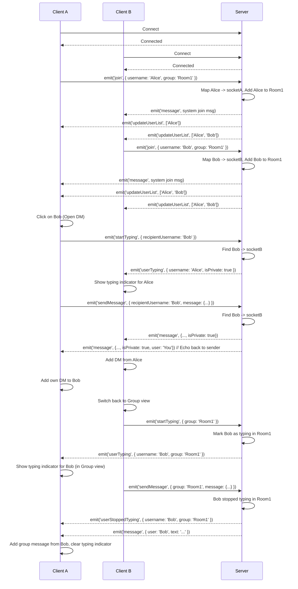

# WhatsApp Clone Frontend with Socket.IO

This project is a simple real-time chat application, mimicking some basic functionalities of WhatsApp, built using Next.js for the frontend and a Node.js/Express server with Socket.IO for the backend communication.

## Features

- **Group Chat:** Users can join existing chat groups or create new ones by specifying a group name.
- **Direct Messaging (DM):** Users can click on a member in the group list to initiate a private chat.
- **Real-time Messaging:** Messages are sent and received in real-time within the active group or DM using WebSockets (via Socket.IO).
- **User Identification:** Users must provide a username before joining a chat. Username uniqueness is checked on the server.
- **User Presence:** Displays a list of users currently present in the _joined group_.
- **Join/Leave Notifications:** System messages notify users within a group when someone joins or leaves.
- **Typing Indicators:** Shows when other users in the current group or DM chat are typing.
- **Emoji Support:** Users can add emojis to their messages using a built-in emoji picker.
- **Chat History Persistence (Client-side):** Remembers the user's username and recently joined groups using browser `localStorage` for quick rejoining. (DM history is not persisted).
- **Modern UI:** Styled using Shadcn/ui components and Tailwind CSS.
- **Component-Based:** Frontend code refactored into smaller, reusable React components.

## Technology Stack

- **Frontend:**
  - Next.js (v14+ with App Router)
  - React
  - TypeScript
  - Socket.IO Client
  - Shadcn/ui
  - Tailwind CSS
  - emoji-picker-react
- **Backend:**
  - Node.js
  - Express
  - Socket.IO Server
  - CORS
- **Package Manager:** pnpm

## How it Works

1.  **Connection:** The Next.js frontend establishes a single, stable WebSocket connection to the backend Socket.IO server on initial load, managed to handle React Strict Mode.
2.  **Joining:**
    - The user enters their desired username (saved to `localStorage`).
    - The user can either click a button to rejoin a recent group (loaded from `localStorage`) or type a new group name and click "Create & Join Group".
    - The frontend emits a `join` event to the server with the username and target group name.
    - The server checks for username conflicts. If the username is taken, a `joinError` is emitted back.
    - If OK, the server adds the user's socket to the specified group (room), stores user/group/socket associations, maps the username to the socket ID, and broadcasts an updated user list (`updateUserList` event) and a system message (`message` event with `type: 'system'`) to the group notifying others of the join.
    - The frontend sets the `joinedGroup` state and sets the `activeChat` to the group, transitioning to the chat view. The group is added to the recent groups list in `localStorage`.
3.  **Direct Messaging (DM):**
    - Clicking a user in the sidebar (who isn't the current user) sets the `activeChat` state to `{ type: 'dm', id: targetUsername }`.
    - The UI switches context, displaying the DM chat history (if any) and updating the header.
4.  **Messaging (Group & DM):**
    - When a user types a message and clicks send, the frontend checks the `activeChat` state.
    - If it's a group chat, it emits a `sendMessage` event with the `group` ID and the message.
    - If it's a DM, it emits a `sendMessage` event with the `recipientUsername` and the message.
    - **Group Message:** The server receives the `sendMessage` with a `group` ID, looks up the group, and broadcasts the message (`message` event) to all _other_ clients in that group's room.
    - **Direct Message:** The server receives the `sendMessage` with a `recipientUsername`, looks up the recipient's socket ID using the `usernameToSocketId` map. If found, it emits the message (`message` event, marked as `isPrivate: true`) _directly_ to that specific socket ID. It also emits the same message back to the _sender's_ socket ID so it appears in their chat history.
    - Clients receive the `message` event. If `isPrivate` is true, the message is added to the corresponding DM state; otherwise, it's added to the group message state. Messages sent by the user are marked with `user: 'You'` for styling.
5.  **Typing Indicators:**
    - When the user types in the input, the frontend emits `startTyping` with either the `group` ID or `recipientUsername` based on `activeChat`.
    - After a timeout (or when a message is sent/chat focus changes), `stopTyping` is emitted with the same context.
    - **Group:** The server receives `startTyping` / `stopTyping` with a `group` ID, updates the user's typing status, and broadcasts `userTyping` / `userStoppedTyping` to _other_ users in the group room.
    - **DM:** The server receives `startTyping` / `stopTyping` with a `recipientUsername`, looks up the recipient's socket ID, and emits `userTyping` / `userStoppedTyping` (marked as `isPrivate: true`) _directly_ to that recipient.
    - The frontend listens for `userTyping` / `userStoppedTyping` and updates the relevant typing state (`typingUsers` for group, `dmTypingUsers` for DMs) to display the indicator in the header for the currently active chat.
6.  **Leaving Group:**
    - When a user clicks the "Leave Group" button (which leaves the _primary joined group_), the frontend emits a `leave` event with the username and `joinedGroup` name.
    - The server removes the user/group association, ensures any typing indicators are cleared, broadcasts a system message (`message` event) notifying others of the departure, and broadcasts an updated user list (`updateUserList` event) to the remaining users in the group.
    - The server makes the user's socket leave the Socket.IO room.
    - The leaving user's frontend UI resets to the join screen.
7.  **Disconnecting:**
    - If a user disconnects (e.g., closes the browser tab), the server detects the `disconnect` event.
    - It cleans up the user's state: removes them from the username mapping, clears any active typing indicators, and performs the `leave` logic for all groups the user was associated with (notifying others, updating user lists).

### Architecture Diagram (Mermaid - Simplified Group + DM + Typing)



## Project Structure

```
/whatsapp-websocket-frontend-clone
|-- /public                 # Static assets for Next.js
|-- /server                 # Backend Node.js server
|   |-- node_modules/
|   |-- server.js           # Express + Socket.IO logic
|   |-- package.json        # Backend dependencies
|   |-- pnpm-lock.yaml
|-- /src                    # Frontend Next.js source
|   |-- /app                # App Router pages
|   |   |-- globals.css     # Tailwind global styles
|   |   |-- layout.tsx      # Root layout
|   |   |-- page.tsx        # Main page component (state management, layout)
|   |-- /components
|   |   |-- /chat           # Chat specific components
|   |   |   |-- ChatHeader.tsx
|   |   |   |-- ChatSidebar.tsx
|   |   |   |-- Icons.tsx
|   |   |   |-- JoinChatForm.tsx
|   |   |   |-- MessageBubble.tsx
|   |   |   |-- MessageInput.tsx
|   |   |   |-- MessageList.tsx
|   |   |-- /ui             # Shadcn UI components (auto-generated)
|   |-- /lib                # Utility functions
|   |   |-- utils.ts        # Shadcn utilities (e.g., cn)
|-- .env.local              # (Optional) Environment variables
|-- .eslintrc.json
|-- .gitignore
|-- components.json         # Shadcn configuration
|-- next-env.d.ts
|-- next.config.mjs         # Next.js configuration
|-- package.json            # Frontend dependencies
|-- pnpm-lock.yaml
|-- postcss.config.mjs
|-- README.md               # This file
|-- tailwind.config.ts      # Tailwind configuration
|-- tsconfig.json
```

## Getting Started

### Prerequisites

- Node.js (v18 or later recommended)
- pnpm (or npm/yarn, but commands below use pnpm)

### Installation

1.  **Clone the repository:**
    ```bash
    git clone https://github.com/hamidfarmani/whatsapp-websocket-frontend-clone.git
    cd whatsapp-websocket-frontend-clone
    ```
2.  **Install Frontend Dependencies:**
    ```bash
    pnpm install
    ```
3.  **Install Backend Dependencies:**
    ```bash
    cd server
    pnpm install
    cd ..
    ```

### Running the Application

1.  **Start the Backend Server:**

    - Open a terminal window.
    - Navigate to the server directory:
      ```bash
      cd server
      ```
    - Run the server:
      ```bash
      node server.js
      ```
    - Keep this terminal running. You should see output like `Server listening on *:3001`.

2.  **Start the Frontend Development Server:**

    - Open a _separate_ terminal window.
    - Make sure you are in the project root directory (`whatsapp-websocket-frontend-clone`).
    - Run the Next.js development server:
      ```bash
      pnpm dev
      ```

3.  **Access the Application:**
    - Open your web browser and navigate to `http://localhost:3000` (or the port specified in the `pnpm dev` output).
    - Open a second browser tab/window to the same address to simulate multiple users.

## Potential Improvements

- Read receipts.
- User profile pictures (beyond initials).
- Persistent message history (database integration for groups and DMs).
- Notifications for new DMs when not actively viewing the DM chat.
- More robust state management (e.g., Zustand, Redux Toolkit).
- Error handling for failed message sends, server issues.
- Deployment configuration.

## Core Socket.IO Concepts

This project relies heavily on Socket.IO for real-time communication between the React frontend and the Node.js backend. Here's a breakdown of the key concepts used:

### `io` vs. `socket`

- **`io` (Server Instance):** Represents the main Socket.IO server instance on the backend (`server/server.js`). It manages _all_ client connections and can broadcast messages globally or to specific rooms. Created via `new Server(httpServer, ...)`.
- **`socket` (Client Connection):** Represents a _single, specific_ client connection.
  - **Server-side:** Inside `io.on('connection', (socket) => { ... })`, `socket` is the object for the newly connected client. Used to listen to events _from_ this client and send messages _back_ to this client.
  - **Client-side:** In the frontend (`src/app/page.tsx`), the `socket` instance (e.g., `socketInstance`) represents _that client's own connection_ to the server. Used to send events _to_ the server and listen for events _from_ the server.

### Event Handling

- **`io.on('connection', callback)` (Server-side):**

  - The primary listener on the server. Triggered when a _new client connects_.
  - The `callback` function receives the `socket` object for that specific client, allowing you to set up individual event listeners for them.
  - _Example:_ `server/server.js` uses this to know when a user connects and then sets up listeners like `socket.on('join', ...)` for that user.

- **`socket.on('eventName', callback)` (Client & Server-side):**

  - Listens for a specific, _custom_ event named `eventName`.
  - **Client-side:** The client must _actively register_ these listeners to tell its `socket` instance which events from the server it cares about (e.g., `'message'`, `'updateUserList'`).
  - **Server-side:** Listens for events emitted _from a specific client_.
  - When the other side `emit`s that event, the corresponding `callback` function on the listening side executes.
  - **Crucially, any `data` sent by the server via `emit('eventName', data)` becomes the argument passed to the client's `callback` function.**
  - _Server Example:_ `socket.on('sendMessage', ...)` listens for a client sending a message.
  - _Client Example:_ `socket.on('message', handleNewMessage)` listens for the server broadcasting a new message. When the server emits `message` with message data, the `handleNewMessage` function on the client runs, receiving the message data as its argument, and updates the React state to display it. Similarly, `socket.on('updateUserList', handleUserListUpdate)` listens for user list updates.

- **`emit('eventName', data)` (Client & Server-side):**
  - Sends an event named `eventName`, optionally with `data`.
  - **`socket.emit(...)`:** Sends _only_ to the other side of that specific connection (server to one client, or client to server).
    - _Example:_ Server sending a `'joinError'` only to the client who failed to join. Client sending a `'startTyping'` event to the server.
  - **`io.emit(...)` (Server-side):** Sends to _all connected clients_. (Broadcast).
    - _Example:_ Announcing server maintenance to everyone.

### Rooms (Groups)

Rooms allow the server to manage and target specific groups of clients.

- **`socket.join('roomName')` (Server-side):**

  - Makes the specific client (`socket`) join the logical room named `roomName`.
  - _Example:_ A user joining a specific chat group like 'General' (`socket.join('General')`).

- **`socket.leave('roomName')` (Server-side):**

  - Makes the specific client (`socket`) leave the room.
  - _Example:_ A user leaving the 'General' chat group.

- **`socket.to('roomName').emit(...)` (Server-side):**

  - Sends an event to _all clients in `roomName`_ **except** the sender (`socket`).
  - _Example:_ Sending a chat message to everyone else in the 'General' room after receiving it from one user.

- **`io.to('roomName').emit(...)` (Server-side):**
  - Sends an event to _all clients in `roomName`_, **including** the sender (if they are in the room).
  - _Example:_ Sending an updated user list for the 'General' room to everyone in that room, including the user whose joining/leaving triggered the update.

## Socket.IO Admin Dashboard

You can monitor the WebSocket server activity using the Socket.IO Admin UI.

1.  Ensure the server is running.
2.  Open your web browser and navigate to [https://admin.socket.io/](https://admin.socket.io/).
3.  Enter the server address: `http://localhost:3001` (or your server's address if different).
4.  Since authentication is disabled (`auth: false` in `server.js`), you don't need a username or password.

From the dashboard, you can view connected clients (sockets), inspect emitted events, view server statistics, and much more.

### STOMP WebSocket Client (`/stomp` page)

In addition to the primary Socket.IO implementation, this project includes a separate chat client example using the STOMP (Simple Text Oriented Messaging Protocol) protocol over WebSockets. This approach is common in enterprise environments, often used with message brokers like RabbitMQ or ActiveMQ, and frameworks like Spring Boot.

- **Technology:** Uses `@stomp/stompjs` and `sockjs-client` on the frontend. `SockJS` provides a WebSocket-like object with fallbacks for older browsers, while `stompjs` handles the STOMP protocol specifics on top of the connection. This contrasts with the Socket.IO client (`socket.io-client`), which uses its own protocol and features like automatic reconnection and multiplexing.
- **Functionality & Key Differences:**
  - **Connection:** Connects to a specific URL (`http://localhost:8080/ws` by default) expected to be a STOMP endpoint, usually provided by a message broker or a backend framework integration (like Spring Boot with WebSocket support). Socket.IO connects directly to the `server.js` endpoint (`http://localhost:3001`).
  - **Communication Model:** STOMP is message-oriented and typically relies on a central message broker. Clients `SUBSCRIBE` to named destinations (topics or queues, e.g., `/topic/public`) to receive messages and `SEND` messages to application-specific destinations (e.g., `/app/chat.sendMessage`). The broker routes messages based on these destinations. Socket.IO uses a more direct event-based model where clients emit named events (`sendMessage`, `join`) to the server, and the server broadcasts or emits events back to clients or specific rooms.
  - **Broker vs. Direct Server:** The STOMP client assumes an intermediary broker managing subscriptions and message routing. The Socket.IO client communicates directly with the custom logic in the Node.js `server.js` file.
  - **Message Structure:** STOMP messages often contain headers and a body (typically JSON in this example). The `stompjs` library parses these. Socket.IO messages are typically simple data payloads (like JavaScript objects) associated with an event name.
  - **Operations:** Instead of Socket.IO's `emit` and `on`, STOMP uses commands like `CONNECT`, `SUBSCRIBE`, `SEND`, `DISCONNECT`. The `@stomp/stompjs` client provides methods like `client.subscribe()`, `client.publish()`, and `client.activate()`.
  - **Example Flow:**
    1. `client.activate()`: Connects to the broker via SockJS/WebSocket.
    2. `client.subscribe('/topic/public', callback)`: Tells the broker to send messages from the `/topic/public` destination to the client's `callback` function.
    3. `client.publish({ destination: '/app/chat.addUser', body: ... })`: Sends a message to the `/app/chat.addUser` destination for the backend application to process (e.g., register the user).
    4. `client.publish({ destination: '/app/chat.sendMessage', body: ... })`: Sends a chat message for the backend to process and likely broadcast to `/topic/public`.
- **Usage:** Navigate to `/stomp` in the application. **Requires a compatible backend STOMP broker** (like a Spring Boot application with WebSocket and STOMP dependencies configured) running and accessible at the specified address (`http://localhost:8080/ws`).
- **Note:** This STOMP client is **functionally separate** from the main Socket.IO chat. It demonstrates a different WebSocket communication pattern and **will not work** with the included Node.js/Socket.IO backend (`server/server.js`). It needs its own dedicated STOMP-compatible backend.
